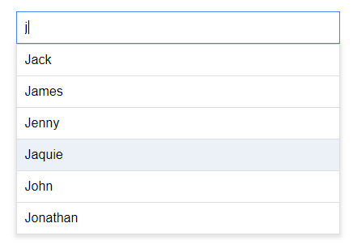
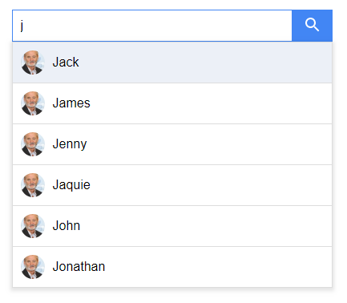
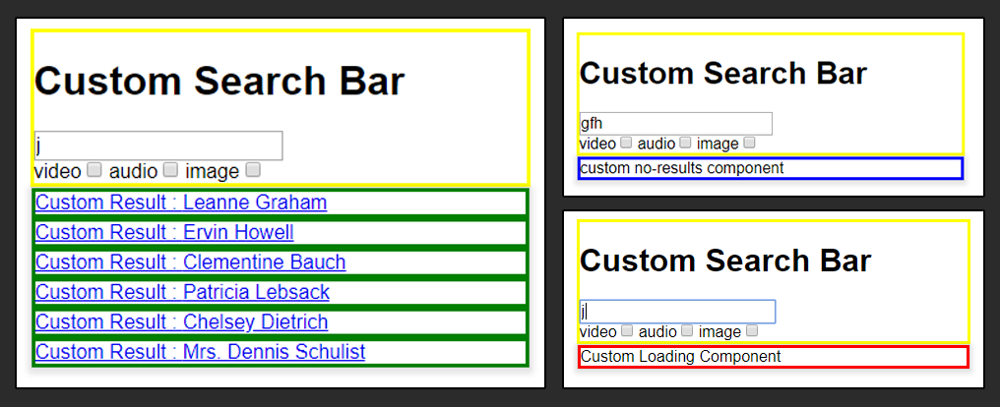

# React Search Bar
React Search Bar (RSB) is a package that supplies common search bar functionality, whilst still allowing the injection of bespoke React components. This enables quick reliable set up of common functionality, whilst allowing flexibility in style/DOM/functionality for your applications requirements. Additionally a configurable out-of-box implementation is supplied in cases where specific styling and functionality are not required.

Generic functions RSB handles :
* Keyboard & Mouse integration (including on blur)
* Efficient query requesting 
* Search result mapping
* Handling number of results displayed
* Handling when search requests are loading
* Handling when no results are found

|  | 
|:--:| 
| *Basic RSB* |

|  | 
|:--:| 
| *Configured RSB* |


|  | 
|:--:| 
| *RSB with injected React components* |

## Properties

### Required Props
The following properties must be passed as properties when implementing RSB

| Property | Type | Description  |
| -------- | ---- | ---------- |
| **searchQueryURLFormatter** | *function* | Formats and returns a URL(string) that is sent to the server to request search results  |
| **resultMapper** | *function* | Is passed the JSON returned from the server, and then formats and returns an object with values mapped to property names corresponding to the result box component |

#### searchQueryURLFormatter Implementation
`searchQueryURLFormatter` function is supplied 3 arguments by RSB:
* *RSB* : `this` value from RSB, exposing all fields
* *searchQuery* : The string value taken from the search box
* *extraQueryOptions* : The optional prop passed into the RSB 

```javascript
let searchQueryURLFormatter = function(RSB, searchQuery, extraQueryOptions) {
	return "http://www.yourserver.com" 
			+ "?searchterm=" + searchQuery 
			+ "?isMale=" + {extraQueryOptions.onlyMales}
			+ "?numberToFetch=" + RSB.props.maxResultsToDisplay
}
```
The value returned from this function will be the URL sent to fetch results from your server.

#### resultMapper Implementation
`resultMapper` function is supplied 2 arguments by RSB:
* *RSB* : `this` value from RSB, exposing all RSB fields
* *qeuryResult* : The server response from the query URL generated by `searchQueryURLFormatter`
* *error* : Error value returned if the search query request errors 

When using the out-of-box results component the values you wish to display *must* be mapped to:
* *title* : The main text displayed in a result instance 
* *imageURL* : The URL of the image to be displayed in a result instance
* *targetURL* : The URL to be navigated to when the result is clicked/enter key is hit

`resultMapper` must return an array. If nothing is returned from your `resultMapper` an empty array will be assigned as the default value;

*IMPORTANT*: In this example the values are mapped to properties for the out-of-box result component. If you are using `customResultsProducer` please see the explanation [here](####customresultsproducer-implementation), for configuring resultMapper for a custom components.

Example:
```javascript
let resultMapper = function(RSB, qeuryResult) {

	// Defines the array to be returned
	let formattedObjects = [];
	
	// Iterate through results and maps results 
	qeuryResult.forEach(function(result, idx) {
		let newObject = {};
		newObject.title = result.field_A;
		newObject.imageURL = result.field_B;
		newObject.targetURL = result.field_C; 
		formattedObjects.push(newObject);
	});

	return formattedObjects;
}
```

### Optional Props
The following properties are not required, but allow you to configure RSB to meet your application's needs.

| Property | Type | Description |
| -------- | ---- | ----------- |
| **searchDelay** | *Integer* | The period of inaction time before a search query fires. As the box searches on type, this property prevents a search being fired for every letter entered, lowering the number of server requests.
| **maxResultsToDisplay** | *Integer* | The maximum number of results displayed
| **useNavLink** | *Boolean* | If you are using ReactRouter and require links to be `<NavLink>` instead of `<a>` set this variable to true.
| **showImage** | *Boolean* | If set to `true` search results will display a square image
| **circleImage** | *Boolean* | If `showImage` is true, you can make the image a circle by setting this property to true
| **noResultsMessage** | *String* | The message displayed when no result is returned from the server |
| **searchButton** | *object* | Requires an object with the format {show: Boolean, onClick: function}. If `show` is true a button will be appended to the search bar. The passed onClick function will be called when the button is clicked, and takes the format `function(RSBRef, event, searchQuery, extraOptions)` |
| **extraOptions** | *Any* | This object will be passed to your `searchQueryURLFormatter` function. The intention is to allow data to impact the search query. For example if you create a filter box, you can pass a JSON object of { onlyFriends: true }, and append that value to the search query before it is sent |

### Custom Components
If the out-of-box  implementation doesn't fit your needs, RSB allows you replace components with your own bespoke React Components. This can be done in a modular way, allowing you to leave in place out-of-box components you wish to use, and replace those you do not. Using custom components does come with some requirements, so be sure to read the detailed implementation details of any method you decide to use.

| Property | Type | Description |
| -------- | ---- | ----------- |
| **customSearchBarProducer** | *function* | Replaces the out-of-box "search bar" DOM with your own bespoke React component |
| **customResultsProducer** | *function* |  Replaces the out-of-box "result" DOM with your own bespoke React component |
| **customLoadingBoxProducer** | *function* | Replaces the out-of-box "loading-spinner" DOM with your own bespoke React component |
| **customNoResultProducer** | *function* | Replaces the out-of-box "no results" DOM with your own bespoke React component |

#### customSearchBarProducer Implementation

Your `customResultsProducer` function is supplied 5 arguments by RSB:
* *RSB* : Exposes all internal values stored by RSB
* *inputTextValue* :  represents the value to be displayed in the search box
* *onKeyDown* : handles `onKeyDown` events on the search bar
* *onFocus* : handles `onFocus` events on the search bar
* *onChange* : handles `onChange` events on the search bar

**This function must return a React Component.**

The follow provided functions should be bound to your custom react component, as seen in the following example :

```javascript
//customResultsProducer to be passed into RSB
let customResultsProducer = function(RSB, inputTextValue, onKeyDown, onFocus, onChange) {
	return (
		<CustomSearchBar 
			searchValue={inputTextValue}
			onKeyDown={onKeyDown}
			onFocus={onFocus}
			onChange={onChange}
		/>
	)
}

// Custom Search Bar
class CustomSearchBar extends React.Component {
	render() {
		return(
			<form>
				<div>
					<input type='text'
						value={this.props.searchValue}
						onKeyDown={this.props.onKeyDown}
						onFocus={this.props.onFocus}
						onChange={this.props.onChange} />
				</div>
			</form>
		)
	}
}
```

#### customResultsProducer Implementation

Your `customResultsProducer` function is supplied 3 arguments by RSB:
* *RSB* : Exposes all internal values stored by RSB
* *idx* : The index of the item in the results set 
* *resultJsonItem* : The result at position `idx` from the returned server results

**This function must return a React Component.**

RSB will automatically append the following properties to your custom result component :

| Property | Type | Description |
| -------- | ---- | ----------- |
| *keyRef* | **Integer** | The index number of the result |
| *isSelected* | **Boolean** | This value returns true if the result is currently selected |
| *onHoverSelect* | **function** | Call this function, passing the keyRef to inform RSB that the current item is to be set as the selected result. (required for mouse selection, however keyboard navigation will work without) |

*IMPORTANT* When using `customResultsProducer` then your `resultMapper` will have to correspond to the properties of that component. An example of a correctly configured custom result component is as follows:


```javascript

// Define the customResultsProducer
let customResultsProducer = function(RSB, idx, resultJsonItem) {
	return(
		<CustomResultBox
			title={resultJsonItem.title}
			subtitle={resultJsonItem.subtitle}
			targetURL={resultJsonItem.targetURL} />
	)
}

// Defines a resultMapper specific for CustomResultBox
let resultMapper = function(queryReturn) {
	let formattedObjects = [];
	
	queryReturn.forEach(function(personResult, idx) {

		//Note that these values match the properties of CustomResultBox
		let newObject = {};
		newObject.title = personResult.name;
		newObject.subtitle = personResult.DoB; 
		formattedObjects.push(newObject);
	});

	return formattedObjects;
}
```

#### customNoResultProducer Implementation

Your `customNoResultProducer` function is supplied with a single argument by RSB:
* RSB : Exposes all internal values stored by RSB

**This function must return a React Component.**


```javascript
let customNoResultProducer = function(RSB) {
	return (<CustomNoResult />)
}

class CustomNoResult extends React.Component {
	render() {
		return(
			<div>
				<p>no results found</p>
			</div>
		)
	}
}

```

#### customLoadingBoxProducer Implementation

Your `customLoadingBoxProducer` function is supplied with a single argument by RSB:
* *RSB* : Exposes all internal values stored by RSB

**This function must return a React Component.**


```javascript
let customLoadingBoxGenerator = function(RSB) {
	return(<CustomLoadingCircle />)
}

class CustomLoadingCircle extends React.Component {
	constructor(props) {
		super(props)
	}

	render() {
		return(
			<div>LOADING...</div>
		)
	}
}

```


### Default Props Values
If no optional properties are supplied to the search component, the following default values will be assigned:

```javascript
default {
	useNavLink: false,
	circularImage: false,
	searchDelay: 300,
	resultsToDisplay: 6,
	showImage: false,
	searchButton: { show: false },
	noResultsMessage: 'No Results Found'
}
```


# Complete Examples
## Fully Customised Out-of-Box Example
```javascript
let onClickButton = function(RSBRef, event, searchQuery, extraOptions) {
	console.log("HIT")
}

let mapperFunction = function(RSB, queryResultJSON, requestError) {
	let formattedObjects = [];
	
	if(!isEmptyObject(queryResultJSON)) {
		queryResultJSON.forEach(function(item, idx) {
			let hasAnyFields = (Object.keys(item).length !== 0)
			let isObject = (item.constructor === Object)

			if(hasAnyFields && isObject) {
				let newObject = {};
				newObject.title = item.name;
				newObject.imageURL = "https://www.fillmurray.com/100/100";
				newObject.targetURL = "www.website./com/myurl/" + item.id;
				formattedObjects.push(newObject);
			}
		});
	}

	return formattedObjects;
}

let queryFormat = function(RSB, searchQuery, extraQueryOptions) {
	let targetURL = 'https://www.yourserver.com/searchTerm?=' + searchQuery; + "?option=" + extraQueryOptions.TEST
	return targetURL;
}

class AppComponent extends React.Component {
	return (
		<div>
			<SearchBar
		  		searchQueryURLFormatter={queryFormat}
				 resultMapper={mapperFunction}
				showImage={true}
				circularImage={true}
				maxResultsToDisplay={3}
				searchDelay={400}
				useNavLink={false}
				searchButton={{ show: true, onButtonClick: onClickButton }}
				noResultsMessage={"NO RESULTS"}
				extraOptions={{"TEST": "Hello World"}}
			/>
		</div>
	);
}

```

## Custom Example
```javascript

//======================= Define Custom Components

class CustomLoadingCircle extends React.Component {
	render() {
		return(
			<div>
				<div>Custom Loading Component</div>
			</div>
		)
	}
}

class CustomSearchResult extends React.Component {
	render() {
		return(
			<a href={this.props.targetURL} onMouseOver={() => this.props.onHoverSelect(this.props.keyRef)}>
				<div>Custom Result : {this.props.title}</div>
			</a>
		)
	}
}

class CustomSearchBar extends React.Component {
	render() {
		return(
			<div>
				<form>
					<h1>Custom Search Bar</h1>
					<div>
						<input type='text'
							value={this.props.searchValue}
							onKeyDown={this.props.onKeyDown}
							onFocus={this.props.onFocus}
							onChange={this.props.onChange}
							className='search-input-text' />
					</div>
				</form>
			</div>
		)
	}
}

class CustomNoResult extends React.Component {
	render() {
		return(<div>no-results found</div>)
	}
}


//======================= Define Producer Functions

let customResultGenerator = function(RSBRef, idx, resultJsonItem) {
	return(
		<CustomSearchResult
			title={resultJsonItem.title}
			targetURL={resultJsonItem.targetURL}
			imageURL={resultJsonItem.imageURL} />
	)
}

let customLoadingBarGenerator = function(RSB) {
	return(<CustomLoadingCircle />)
}

let customNoResultProducer = function(RSB) {
	return (<CustomNoResult />)
}

let customSearchBarGenerator = function(RSB, inputTextValue, onKeyDown, onFocus, onChange) {
	return (
		<CustomSearchBar 
			searchValue={inputTextValue}
			onKeyDown={onKeyDown}
			onFocus={onFocus}
			onChange={onChange}
		/>
	)
}


//======================= Define ResultMapper and QueryFormat

let mapperFunction = function(RSB, queryResultJSON, requestError) {	
	let formattedObjects = [];
	
	if(!isEmptyObject(queryResultJSON)) {
		queryResultJSON.forEach(function(item, idx) {
			let hasAnyFields = (Object.keys(item).length !== 0)
			let isObject = (item.constructor === Object)

			if(hasAnyFields && isObject) {
				let newObject = {};
				newObject.title = item.name;
				newObject.imageURL = "https://www.fillmurray.com/100/100";
				newObject.targetURL = "www.website./com/myurl/" + item.id;
				formattedObjects.push(newObject);
			}
		});
	}

	return formattedObjects;
}

let queryFormat = function(RSB, searchQuery, extraQueryOptions) {
	let targetURL = 'https://www.yourserver.com/searchTerm?=' + searchQuery;
	return targetURL;
}


//======================= Your Application

class CustomApplication extends React.Component {
	render() {
		return (
	      <div>
	      	<div>
				<SearchBar
		      		searchQueryURLFormatter={queryFormat}
		  		 	resultMapper={mapperFunction}
		  		 	customSearchBarProducer={customSearchBarGenerator}
		  		 	customResultsProducer={customResultGenerator}
		  		 	customLoadingBoxProducer={customLoadingBarGenerator}
		  		 	customNoResultProducer={customNoResultProducer}
		  		 />
	      	</div>
	      </div>
	    );
	}
}

```


